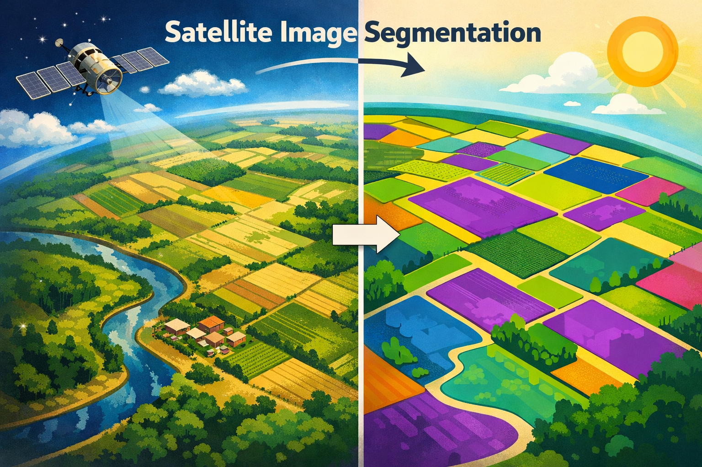
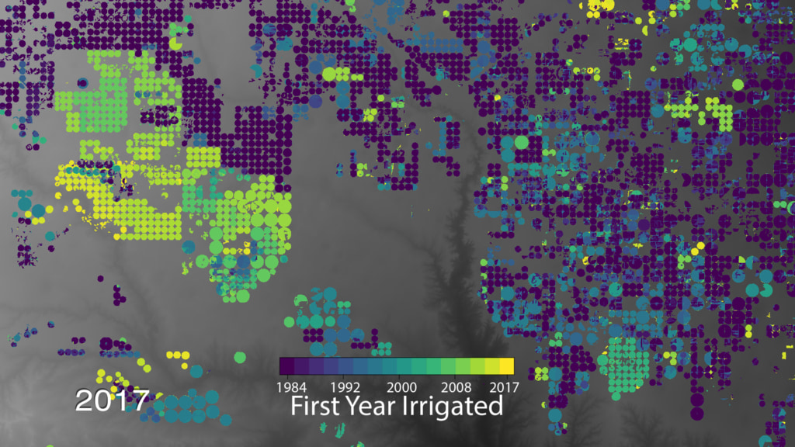

<!--
  README for the Prithvi‑EO Segmentation project

  This document provides an overview of the dataset preprocessing pipeline,
  model training and evaluation, and land‑cover mapping workflow used in this
  repository.  It also summarises the capabilities of the Prithvi Earth
  Observation (EO) foundation models and how they are used for semantic
  segmentation of satellite imagery.  Figures illustrating example results
  and a conceptual diagram of the segmentation workflow are included below.
-->

# Prithvi‑EO Segmentation

Semantic segmentation of satellite imagery is a core task for mapping land
cover, estimating agricultural yield, monitoring floods, or analysing
wildfire scars.  This repository demonstrates how to preprocess
multi‑spectral Sentinel/Harmonized Landsat–Sentinel (HLS) data, train
segmentation models with the **Prithvi EO** foundation models using
TerraTorch, evaluate model performance, and generate georeferenced land‑
cover footprints.  Prithvi‑EO models are transformer‑based geospatial
foundation models trained on millions of spatio‑temporal satellite samples
【422421131852148†L306-L329】.  They extend the Vision Transformer (ViT)
architecture by replacing 2‑D patch embeddings and positional embeddings
with **3‑D** counterparts to support sequences of images over time and by
adding learnable temporal and location embeddings【422421131852148†L306-L329】.
Prithvi‑EO‑2.0 models are trained on a global HLS dataset; the largest
600M‑parameter variant with temporal and location embeddings outperforms
earlier Prithvi versions and other geospatial foundation models by roughly
8 percentage points across a range of remote‑sensing tasks【422421131852148†L349-L354】.

## Contents

This project is organised into several notebooks and utilities:

| Component | Purpose | Notes |
|----------|---------|------|
| **1. `Pre_process_data.ipynb`** | Download raw Sentinel/HLS images and masks, split them into manageable patches, encode them as NPZ or TFRecord files and divide the dataset into training/validation/test splits | Also creates directory structure for storing patches and exports data in TensorFlow‑friendly TFRecord format |
| **2. `Training_and_Segmentation.ipynb`** | Build a PyTorch dataset for NPZ/TFRecord patches, apply data augmentation with Albumentations, define a semantic segmentation model using the TerraTorch library with a Prithvi EO backbone, and run training | Includes a table describing different Prithvi‑EO model sizes (see below) and utility functions for making predictions and visualising results |
| **3. `model_evaluation.ipynb`** | Load a trained model and compute precision, recall, F1 score and Intersection‑over‑Union (IoU) on a validation set | Uses helper functions to run inference and aggregate metrics per class |
| **4. `Create_footprint_prithvi.ipynb`** | Demonstrate large‑scale inference by downloading big satellite scenes, cropping them into tiles, running the segmentation model on each tile and merging predictions back into a single GeoTIFF | Provides functions for padding/cropping, writing GeoTIFFs and merging predicted masks into a georeferenced footprint |
| **`image_utils.py`** | Helper routines for reading and displaying images, padding images, converting between colour spaces and computing simple metrics | Used by the notebooks to visualise data and predictions |

## Prithvi‑EO backbone variants

The TerraTorch‑based model definitions in this project support several
pretrained Prithvi‑EO backbones.  The table below summarises the main
variants.  Short descriptions are used in accordance with the guidelines
above (see the training notebook for detailed descriptions).

| Model | Parameters | Key features |
|------|-----------|-------------|
| **Prithvi‑EO‑1.0‑100M** | 100 M | Original 2‑D ViT backbone trained on US‑only HLS data |
| **Prithvi‑EO‑2.0‑100M** | 100 M | Same size as 1.0 but pretrained on a global dataset |
| **Prithvi‑EO‑2.0‑300M** | 300 M | Larger backbone trained on global HLS data (no temporal/location embeddings) |
| **Prithvi‑EO‑2.0‑300M‑TL** | 300 M | Adds temporal & location embeddings to the 300 M model |
| **Prithvi‑EO‑2.0‑600M** | 600 M | Very large model without temporal/location embeddings |
| **Prithvi‑EO‑2.0‑600M‑TL** | 600 M | Largest model with both temporal and location embeddings; this variant outperforms earlier Prithvi versions across diverse tasks【422421131852148†L349-L354】 |

## Getting started

### Installation

1. **Clone this repository** and change into the project directory:

   ```bash
   git clone https://github.com/easare377/Prithvi-EO-Segmentation.git
   cd Prithvi‑EO‑Segmentation
   ```

2. **Create a Python environment** (Python ≥ 3.8 is recommended) and
   install dependencies:

   ```bash
   python -m venv .venv
   source .venv/bin/activate
   pip install -r requirements.txt
   ```

   A GPU with CUDA support is strongly recommended for training large
   models.  The `requirements.txt` file lists PyTorch, segmentation models,
   GDAL/GeoPandas for geospatial operations and the TerraTorch library for
   working with Prithvi‑EO backbones.

3. **Download satellite data and masks**.  The notebooks assume access
   to Sentinel‑2 or Harmonized Landsat–Sentinel imagery and corresponding
   segmentation masks.  You can obtain labelled datasets from public
   sources such as the Multi‑temporal Crop Classification dataset for the
   United States (hosted on Hugging Face) or your own annotated data.  See
   the preprocessing notebook for examples of downloading and organising
   data.

### Preprocessing

The `Pre_process_data.ipynb` notebook walks through the steps required
to prepare remote‑sensing data for training:

1. **Download and organise** images and masks into a structured folder.
2. **Patch and encode** large tiles into manageable patches using the
   provided functions, saving them as NPZ arrays or TFRecords.
3. **Split** the dataset into training, validation and test sets, and
   export them into dedicated folders.
4. **Convert to TFRecord** (optional) for efficient streaming during
   training with TensorFlow.

### Training

The `Training_and_Segmentation.ipynb` notebook shows how to train a
semantic segmentation model using PyTorch and TerraTorch:

1. **Load patches** via a custom `Dataset` class that normalises
   spectral bands and optionally pads images to square shapes.
2. **Augment** training data with Albumentations (random flips,
   rotations and colour jitter).
3. **Select a backbone** from the table above and instantiate a
   segmentation model.  The model uses the Prithvi‑EO encoder and a
   lightweight decoder (e.g., U‑Net‑style).  Pretrained weights can be
   loaded for transfer learning or training from scratch.
4. **Train** the model using your favourite optimiser.  The notebook
   includes a simple training loop with checkpointing and utilities for
   printing the number of parameters and running a forward pass.

### Evaluation

Use `model_evaluation.ipynb` to assess how well your model performs on
unseen data.  The notebook demonstrates:

1. **Loading the trained model** and preparing a validation DataLoader.
2. **Computing metrics** such as precision, recall, F1 score and IoU per
   class.
3. **Visualising predictions** using the helper functions provided in
   `image_utils.py`.

### Land‑cover mapping

Large‑scale inference on full‑resolution scenes is handled in
`Create_footprint_prithvi.ipynb`.  This notebook explains how to:

1. **Download big satellite scenes**, e.g., from AWS or the NASA HLS
   repository.
2. **Crop and pad** each scene into tiles, run the segmentation model
   on each tile and write GeoTIFFs for individual predictions.
3. **Merge predictions** into a single georeferenced raster or vector
   footprint using GDAL and GeoPandas.  This allows you to create
   continuous land‑cover maps or footprints for a region of interest.

## Example results

Below are example figures generated using this pipeline.  The first
illustration is a conceptual diagram showing how satellite images are
converted into segmentation masks.  The second image shows an example
overlay produced by the segmentation model on a farmland scene, and the
third image depicts irrigation patterns detected from remote‑sensing data.

### Conceptual diagram



*An artistic representation of satellite image segmentation: the left panel
shows a stylised satellite view of agricultural land while the right panel
shows a simplified mask produced by a segmentation model.*

### Farmland segmentation overlay


*A cropped and down‑sampled satellite scene over agricultural fields with a
purple overlay indicating the predicted boundaries of cultivated areas.*

### Irrigation map



*This remote‑sensing composite highlights irrigation infrastructure in
farmland.  The colours represent different features detected by the
segmentation model.*

## Citing Prithvi‑EO

If you use the Prithvi‑EO models in your work, please cite the official
Prithvi‑EO‑2.0 paper and associated resources.  The architecture uses
masked autoencoding with 3‑D patch embeddings and includes time and
location encodings【422421131852148†L306-L329】.  The largest model variant
exceeds the performance of earlier geospatial foundation models by
approximately 8 percentage points across benchmarks【422421131852148†L349-L354】.

## Contributing

Contributions are welcome!  If you find a bug, have a feature request or
want to add a new notebook, please open an issue or submit a pull
request.  When contributing code, follow the existing coding style and
provide clear docstrings and comments.

## License

This project is distributed under the MIT License.  See the upstream
Prithvi‑EO repositories and TerraTorch for additional licensing details.
